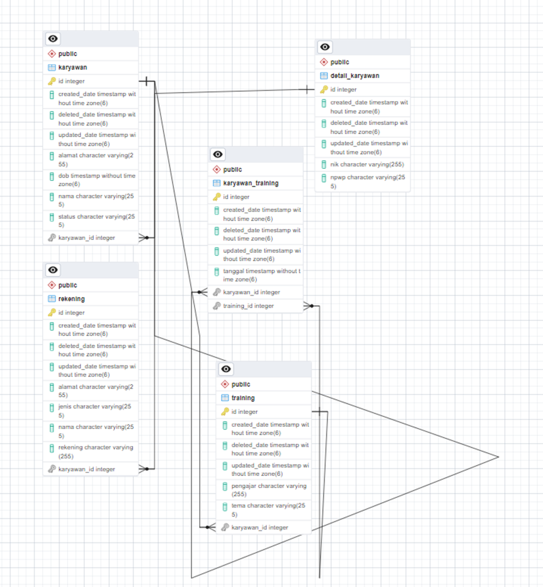

# RESTful API karyawan-training


## Tampilan ERD


## collection postman: https://app.getpostman.com/join-team?invite_code=46dff92b7d3e0f03568bca5529b0c00c&target_code=a73f1d35c64de27f70c504d8c714c15f

## API Specs
### Insert Karyawan
Request:
- Method: POST
- Endpoint: /api/v1/karyawans
- Body

```json
{
    "nama": "string",
    "dob": "YYYY-MM-DDTHH:MM:SSZ",
    "status": "string",
    "alamat": "string",
    "detailKaryawan": {
        "nik": "string",
        "npwp": "string"
    }
}
```
Response:

```json
{
    "code": 200,
    "data": {
        "createdDate": "YYYY-MM-DDTHH:MM:SSZ",
        "updatedDate": "YYYY-MM-DDTHH:MM:SSZ",
        "deletedDate": "YYYY-MM-DDTHH:MM:SSZ",
        "id": 1,
        "nama": "string",
        "dob": "YYYY-MM-DDTHH:MM:SSZ",
        "status": "string",
        "alamat": "string",
        "detailKaryawan": {
            "createdDate": "YYYY-MM-DDTHH:MM:SSZ",
            "updatedDate": "YYYY-MM-DDTHH:MM:SSZ",
            "deletedDate": "YYYY-MM-DDTHH:MM:SSZ",
            "id": 1,
            "nik": "string",
            "npwp": "string"
        }
    },
    "status": "string"
}
```
